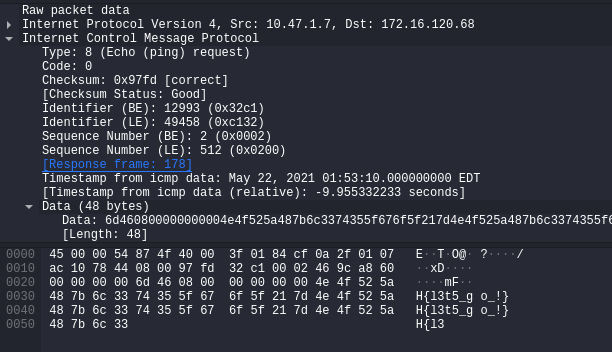
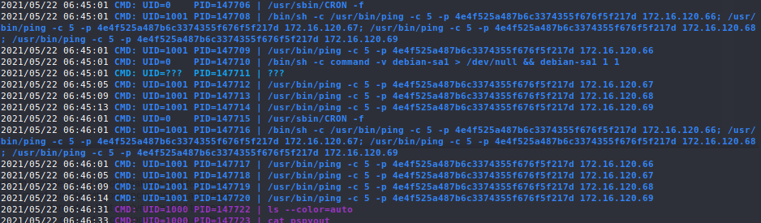

Connect to the CTF VPN

Monitor traffic on the VPN interface with Wireshark

We see a few interesting ICMP packets come from a few hosts within the network.

At a glance, it looks like we can see part of the flag.

Copy the bytes as printable text and we can see the flag in its entirety after pasting it.

`NORZH{l3t5_go_!}`

As a bonus, on one of the hosts we were able to compromise, we can see some ping commands being run periodically with the padding bytes (`-p`) set as the flag which will send these ICMP packets over to each of our team's hosts.

Flag: `NORZH{l3t5_go_!}`
